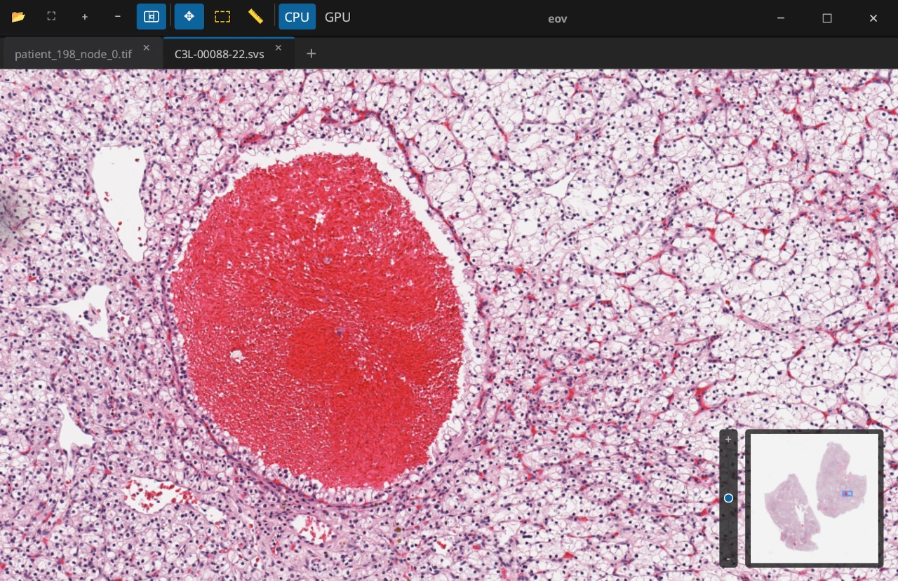

# eov — A lightweight WSI viewer

<p align="center">
    
</p>


eov is a desktop viewer for whole-slide images built in Rust. It fills a niche in the WSI ecosystem: a small, higher-performance workbench for quickly viewing WSI files on your local machine. The feature scope is intentionally narrow with its design principle of "small Linux utility for WSI".

Whereas the sister project [Eosin](https://github.com/eosin-platform/eosin) solves the institution-scale WSI problem, eov aims to provide researchers (and anyone else interested in WSI!) with frictionless viewer capabilities without any extraneous dependencies (e.g. servers, cloud infrastructure).

The name `eov` has no canonical expansion.

## Overview

eov opens pyramid-based whole-slide image files through OpenSlide and presents them in a desktop viewer designed for fast inspection.

Current capabilities include:

- Open WSI files from the file picker, drag and drop, recent-files list, or the command line.
- A tab- and pane-based layout
- Duplicate tabs into additional panes for side-by-side comparison.
- Drag tabs between panes, reorder tabs, and create splits by dropping onto pane edges.
- Pan and zoom smoothly with on-demand tile loading and cached rendering.
- Toggle between CPU and GPU rendering, with automatic fallback to CPU when GPU rendering is unavailable.
- A minimap thumbnail with viewport navigation and a zoom slider.
- Basic "Region of Interest" and "Measure Distance" tools.
- Various quality of life enhancements expected from modern software packages

## Screenshots

<p align="center">
    
    &nbsp;
    
</p>

## Supported Formats

eov relies on [OpenSlide](https://openslide.org/) for slide access, so the formats it can open are the formats OpenSlide supports on the host system. The application explicitly offers these common extensions in the file picker:

- `.svs`
- `.tif`
- `.tiff`
- `.ndpi`
- `.vms`
- `.vmu`
- `.scn`
- `.mrxs`
- `.bif`

If OpenSlide can open the file, eov should be able to load it.


## CLI

The application can be launched as a desktop viewer or used through a small CLI surface:

```text
eov [OPTIONS] [FILES]...
eov probe <FILE>
eov recent list
eov config-path
```

Examples:

```bash
eov slide.svs
eov slide1.svs slide2.svs slide3.svs
eov --debug --backend gpu slide.svs
eov --cache-size 512 --max-tiles 4096 slide.svs
eov --gpu slide.svs
eov --log-level debug probe fixtures/C3L-00088-22.svs
eov --config /tmp/config.toml config-path
eov recent list
```

Notable options:

- `--backend auto|cpu|gpu`
- `--cpu` and `--gpu` as shorthands for `--backend cpu|gpu`
- `--debug` to enable debug overlays in the UI
- `--log-level error|warn|info|debug|trace`
- `--cache-size <MB>` to set the tile-cache budget in megabytes. Default and recommended value: `256`.
- `--max-tiles <COUNT>` to cap the number of cached tiles. Default and recommended value: `2048`.
- `--config <PATH>` to override the active config file path for the current process

## Architecture

This repository is a Cargo workspace with two crates:

- `common`: WSI access, tile management, caching, viewport math, and benchmarks.
- `app`: the desktop application built with Slint + CPU/GPU rendering paths.

At a high level, the flow is:

1. Open a slide through OpenSlide.
2. Read slide metadata and pyramid levels.
3. Compute visible tiles for each active viewport.
4. Load tiles in the background and cache them.
5. Render the composed image through the selected backend.

## Requirements

To build and run eov you need:

- A recent Rust toolchain with Cargo.
- OpenSlide installed on the system, including the development package needed for linking.
- The native libraries required by Slint, winit, and the selected graphics stack on your platform.

On Linux, the most important dependency is usually OpenSlide itself. Depending on your distribution, you may also need the usual X11, Wayland, EGL, and font development packages used by Rust GUI applications.

## Building

Build the release binary from the workspace root:

```bash
cargo build --bin eov --release
```

For a development build:

```bash
cargo build --bin eov
```

## Linux Packaging

Linux packaging assets live under `assets/linux/` and `packaging/`.

- AppImage is the first-class direct-download Linux artifact.
- Flatpak support is included for sandboxed distribution.
- OpenSlide remains dynamically linked on Linux for LGPL-2.1 compliance.
- AppImage packaging bundles the OpenSlide shared library and required runtime
    shared libraries into the AppDir/AppImage instead of statically linking it.

Current packaging entry points:

- `./packaging/appimage/build.sh`
- `packaging/flatpak/io.eosin.eov.yml`

## Running

Launch the viewer without opening a file:

```bash
cargo run --bin eov --release
```

Open one or more files from the command line:

```bash
cargo run --bin eov --release -- /path/to/slide.svs
```

You can also pass multiple file paths after `--`, which opens all of the files as separate tabs.

Available launch flags:

- `--cpu`: force the CPU renderer.
- `--gpu`: prefer the GPU renderer.
- `--debug` or `-d`: enable debug mode, including the FPS overlay.
- `--cache-size <MB>`: override the tile cache size in megabytes. Default and recommended value: `256 MB`.
- `--max-tiles <COUNT>`: override the maximum number of cached tiles. Default and recommended value: `2048`.

If `--gpu` is requested but a compatible GPU backend is not available, eov falls back to the CPU renderer.

## Basic Usage

- Open a file from the toolbar, by drag and drop, or from the recent-files menu.
- Use the scroll wheel to zoom.
- Drag in navigate mode to pan.
- Use the toolbar to switch between navigate, ROI, and measurement tools.
- Use the frame action to frame the ROI if one exists, or fit the full slide otherwise.
- Right-click a tab for tab actions such as close, split right, open containing folder, or copy path.
- Drag tabs between panes to reorganize the workspace.
- Drop a dragged tab near a pane edge to create a new split.
- Toggle the minimap from the toolbar.
- Select CPU or GPU rendering from the toolbar.

## Configuration And Persistence

eov currently persists two kinds of state:

- Preferred render backend in `~/.eov/config.toml` by default.
- Recently opened files in the XDG config directory under `eov/recent_files.txt`.

You can override the render-backend config path with the `EOV_CONFIG` environment variable.

Example backend config:

```toml
render_backend = "gpu"
```

## Repository Layout

```text
.
├── Cargo.toml            # Workspace definition
├── app/                  # Desktop application crate
│   ├── src/              # Application logic, rendering, callbacks, state
│   └── ui/               # Slint UI components
├── common/               # Shared WSI, tile, cache, and viewport code
│   ├── src/
│   └── benches/
└── fixtures/             # Sample data used for local testing/benchmarks
```

## Status

The project is functional and already supports the core interactive viewing workflow, but it is still evolving. Expect the UI, configuration layout, and supported workflows to continue changing as the viewer matures.

Contributions are welcome. This project is part of the [Eosin Platform](https://github.com/eosin-platform).


## License

Apache 2.0 / MIT dual license.