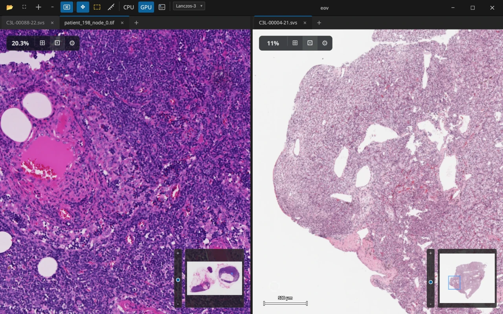
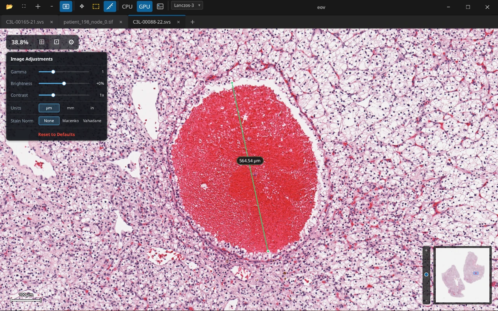
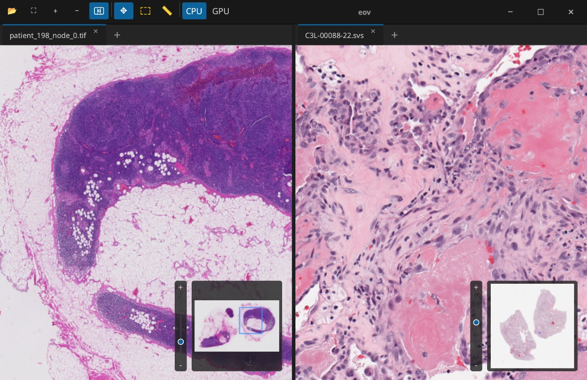

# eov — A lightweight WSI viewer

[](https://github.com/eosin-platform/eov/actions/workflows/ci.yml)
[](https://github.com/eosin-platform/eov/actions/workflows/release.yml)

[](https://github.com/eosin-platform/eov#license)
[](https://github.com/eosin-platform/eov/pulse)

<p align="center">
    
</p>
<p align="center">
    <a href="https://eov.sh">Website</a>
</p>


eov is a cross-platform desktop viewer for whole-slide images built with [Rust](https://rust-lang.org/) and [Slint](https://slint.dev/). It fills a niche in the WSI ecosystem: a small, high-performance workbench for quickly viewing WSI files on your local machine. The feature scope is intentionally narrow with its design principle of "small Linux-style utility for WSI".

Whereas the sister project [Eosin](https://github.com/eosin-platform/eosin) solves the institution-scale WSI problem, eov aims to provide researchers - and anyone else interested in WSI - with frictionless viewer capabilities free of extraneous dependencies (e.g. servers, cloud infrastructure).

The name `eov` has no canonical expansion.

## Installation

Windows, macOS, and Linux are supported. Prebuilt binaries can be downloaded from the [Release page](https://github.com/eosin-platform/eov/releases/tag/v0.2.14).

Both x86_64 and arm64 builds for all supported platforms are available. Make you sure you select the right architecture!

### macOS
The `.app` file is available. For Intel-based Macs, download the release with `x86` in the name. Apple M-series machines require the `arm64` bundle:
- [Apple Silicon (M-series)](https://github.com/eosin-platform/eov/releases/download/v0.2.14/eov-v0.2.14-macos-arm64.zip) (all Macs released since June 2023)
- [Intel (x86_64) Mac](https://github.com/eosin-platform/eov/releases/download/v0.2.14/eov-v0.2.14-macos-x86_64.zip) (All Macs released prior to 2020 and some through 2023)

Download and open the `.app` file to run it. The app is not signed and you'll see an error message about the app being from an unidentified developer. To fix this, go to System Preferences → Security & Privacy and hit the "Open Anyway" button. Expect to repeat this process whenever you download a new version. 

Installation via `brew` is currently a work-in-progress. 

### Windows
A zip file containing a portable Windows build is available:
- [x86_64](https://github.com/eosin-platform/eov/releases/download/v0.2.14/eov-v0.2.14-windows-x86_64.zip) (most Windows machines)
- [arm64](https://github.com/eosin-platform/eov/releases/download/v0.2.14/eov-v0.2.14-windows-arm64.zip) (rarer)

Extract and run `eov.exe` within the zip to start the program. Only the portable version is available; no Windows installer is planned. Because the binary is not signed, you'll get a security alert when attempting to open it. This alert can be safely bypassed through the "Run anyway" button. You will be hassled by this dialog every time you download a new version.

If you want the `eov` command to be available via PATH (e.g. for command prompt or PowerShell) you can do this by [adding `C:/path/to/eov` to System Variables](https://learn.microsoft.com/en-us/previous-versions/office/developer/sharepoint-2010/ee537574%28v%3Doffice.14%29) (given `C:/path/to/eov/eov.exe` reflects your directory structure).

### Linux
There are two methods of installation.

- AppImage: [x86_64](https://github.com/eosin-platform/eov/releases/download/v0.2.14/eov-v0.2.14-linux-x86_64.AppImage) | [arm64](https://github.com/eosin-platform/eov/releases/download/v0.2.14/eov-v0.2.14-linux-aarch64.AppImage)
- Flatpak: [x86_64](https://github.com/eosin-platform/eov/releases/download/v0.2.14/eov-v0.2.14-linux-x86_64.flatpak) | [arm64](https://github.com/eosin-platform/eov/releases/download/v0.2.14/eov-v0.2.14-linux-aarch64.flatpak)

The AppImage is directly executable:

```bash
# Download the binary
curl -L -o eov https://github.com/eosin-platform/eov/releases/download/v0.2.14/eov-v0.2.14-linux-x86_64.AppImage

# Make it executable (ensure correct filename!)
chmod +x ./eov

# Run it directly
./eov

# Install it system-wide (optional)
sudo mv eov /usr/local/bin/eov

# Start the installed app with a nice, short command from any directory:
eov
```

### Example WSI Files

To make testing easier, here are a few (relatively) small WSI files that can be opened by `eov`. These are clear cell renal carcinoma slides from [CPTAC-CRCC](https://www.cancerimagingarchive.net/collection/cptac-ccrcc/):
- [C3L-00004-21.svs](https://cptac.nyc3.digitaloceanspaces.com/images/CPTAC-CCRCC/C3L-00004-21.svs) (169MB)
- [C3L-00088-22.svs](https://cptac.nyc3.digitaloceanspaces.com/images/CPTAC-CCRCC/C3L-00088-22.svs) (322MB)

Refer to the [data appropriation guide](./data-guide.md) for details on how to bulk download WSI files from various datasets.

## Overview

eov opens pyramid-based whole-slide image files through OpenSlide and presents them in a desktop viewer designed for fast inspection.

Current capabilities include:

- Open WSI files from the file picker, drag and drop, recent-files list, or the command line.
- A tab- and pane-based layout
- Duplicate tabs into additional panes for side-by-side comparison.
- Drag tabs between panes, reorder tabs, and create splits by dropping onto pane edges.
- Pan and zoom smoothly with on-demand tile loading and cached rendering.
- Toggle between CPU and GPU rendering (Vulkan).
- Adaptive [Lanczos](https://en.wikipedia.org/wiki/Lanczos_resampling) (high quality), [Trilinear](https://en.wikipedia.org/wiki/Trilinear_filtering) (industry standard, performant), and [Bilinear](https://en.wikipedia.org/wiki/Bilinear_interpolation) (fast) texture filtering.
- Real-time image adjustments: sharpness (unsharp mask), gamma, brightness, and contrast sliders applied via convolution + per-channel LUT (CPU) or per-pixel shader (GPU).
- Stain normalization: Macenko (SVD/PCA angular-percentile) and Vahadane (sparse non-negative dictionary learning) methods, both running on CPU and GPU backends with matched output.
- Color deconvolution: separate and visualize individual H&E stain channels with per-channel intensity control and channel isolation, on both CPU and GPU.
- A calibrated scale bar with automatic unit selection (µm, mm, inches) when microns-per-pixel metadata is available.
- A minimap thumbnail with viewport navigation and a zoom slider.
- Basic "Region of Interest" and "Measure Distance" tools.
- Export Image: right-click the viewport to export the current view as PNG or JPEG with configurable DPI, filtering mode, stain normalization, color deconvolution, and optional measurement/ROI overlays.
- Dataset patch extraction: extract fixed-grid image tiles from one or more slides via the CLI for ML / dataset workflows, with optional CSV or JSON metadata export.
- Various quality of life enhancements expected from modern software packages

## Screenshots

<p align="center">
    
    &nbsp;
    
    &nbsp;
    
</p>

## Texture Filtering

eov provides three texture filtering modes, selectable from the viewport context menu:

| Mode | Description |
|------|-------------|
| **Bilinear** | Single mip-level sampling. Fastest, but can exhibit aliasing at low zoom. |
| **Trilinear** | Bilinear sampling with mip-level blending for smooth transitions across zoom levels. The default mode. |
| **Lanczos-3** | High-quality resampling using a windowed sinc kernel (a=3). Adaptively blends with trilinear at very low zoom to avoid ringing artifacts. |

Both CPU and GPU backends support all three modes. On the GPU path, trilinear blending is performed by sampling fine and coarse mip textures and mixing in the fragment shader. Lanczos resampling is implemented as a separable kernel evaluated per-pixel in a dedicated shader.

## Image Adjustments

Real-time image adjustment controls are available in the HUD settings panel:

| Parameter | Range | Default | Description |
|-----------|-------|---------|-------------|
| Sharpness | 0.0 – 1.0 | 0.0 | Unsharp mask via 4-connected Laplacian kernel. 0 = disabled (bypass), 1 = maximum sharpening. |
| Gamma | 0.2 – 3.0 | 1.0 | Power-law intensity curve. Values below 1.0 brighten shadows; above 1.0 darkens them. |
| Brightness | -1.0 – 1.0 | 0.0 | Additive offset applied after gamma correction. |
| Contrast | 0.2 – 3.0 | 1.0 | Multiplicative scaling around the midpoint (0.5) after brightness. |

The CPU backend applies sharpening as a Laplacian convolution pass over the composited buffer, followed by gamma/brightness/contrast through a precomputed 256-entry lookup table. The GPU backend applies the same pipeline per-pixel in the fragment shader.

## Stain Normalization

eov includes two H&E stain normalization methods for histology images, selectable from the HUD settings panel:

- **Macenko** ([Macenko et al., 2009](https://www.researchgate.net/publication/221624097_A_Method_for_Normalizing_Histology_Slides_for_Quantitative_Analysis)): Projects tissue optical density onto its principal stain plane via SVD, then identifies hematoxylin and eosin vectors from angular percentile extremes (1st and 99th percentile).
- **Vahadane** ([Vahadane et al., 2016](https://pubmed.ncbi.nlm.nih.gov/27164577/)): Learns a two-component stain dictionary via sparse non-negative matrix factorization with L1 (LASSO) regularization, producing a physically-motivated decomposition that preserves local tissue structure.

Both methods share a common normalization pipeline: RGB → optical density conversion, tissue masking, stain matrix estimation, least-squares concentration solve, 99th-percentile concentration scaling to a reference target, and reconstruction. The CPU and GPU backends produce matched output — stain matrix estimation runs on the CPU from raw tile data, while per-pixel normalization runs either as a CPU buffer pass or as a GPU fragment shader transform.

## Color Deconvolution

eov supports real-time H&E color deconvolution, which separates a histology image into its constituent hematoxylin and eosin stain channels using the Beer–Lambert optical density model ([Ruifrok & Johnston, 2001](https://pubmed.ncbi.nlm.nih.gov/11531144/)). Controls are available in the HUD settings panel:

- **Intensity control**: adjust per-channel stain intensity to enhance or suppress individual components.
- **Channel isolation**: view a single stain channel in isolation to inspect hematoxylin (nuclei) or eosin (cytoplasm/stroma) contributions separately.

When stain normalization is active, the deconvolution reuses the slide-specific stain matrix estimated by the normalization step, so channel separation reflects the actual stain vectors of the current slide. Otherwise the default Ruifrok & Johnston reference matrix is used. Both CPU and GPU backends are supported.

## Supported Formats

eov relies on [OpenSlide](https://openslide.org/) for slide access, so the formats it can open are the formats OpenSlide supports on the host system. The application explicitly offers these common extensions in the file picker:

- `.svs`
- `.tif`
- `.dcm`
- `.ndpi`
- `.vms`
- `.vmu`
- `.scn`
- `.mrxs`
- `.tiff`
- `.svslide`
- `.bif`
- `.czi`

If OpenSlide can open the file, eov should be able to load it.

## CLI

The application can be launched as a desktop viewer or used through a small CLI surface:

```text
eov [OPTIONS] [FILES]...
eov probe <FILE>
eov recent list
eov config-path
```

Examples:

```bash
eov slide.svs
eov slide1.svs slide2.svs slide3.svs
eov --debug --backend gpu slide.svs
eov --cache-size 512 --max-tiles 4096 slide.svs
eov --cpu slide.svs
eov --gpu --filtering-mode lanczos slide.svs
eov --log-level debug probe fixtures/C3L-00088-22.svs
eov --config /tmp/config.toml config-path
eov recent list
```

Notable options:

- `--backend auto|cpu|gpu`
- `--cpu` and `--gpu` as shorthands for `--backend cpu|gpu`
- `--debug` to enable debug overlays in the UI
- `--log-level error|warn|info|debug|trace`
- `--cache-size <MB>` to set the tile-cache budget in megabytes. Default and recommended value: `256`.
- `--max-tiles <COUNT>` to cap the number of cached tiles. Default and recommended value: `2048`.
- `--config <PATH>` to override the active config file path for the current process
- `--plugin-dir <PATH>` to set the plugin search directory. Default: `~/.eov/plugins/`
- `--extension-host-port <PORT>` the port use for the extension host (required for non-Rust plugins)

## Dataset Patch Extraction

eov includes a functionality for extracting fixed-grid image patches from whole-slide images, useful for building ML datasets. Tiles that are mostly white can be omitted via `--white-threshold` (range 0.0 to 1.0) so only useful tiles with useful data are exported. A white threshold of `0.8` tends to do well.

This feature can be accessed via the "Export Dataset" action in the toolbar (icon ) or via CLI:

```bash
eov dataset patches <inputs...> --out <dir> --tile-size <n> --stride <n> [--metadata csv|json] --white-threshold 0.8
```

The command accepts individual slide files, multiple slide paths, or directories (searched recursively for supported slide formats). A deterministic grid of non-overlapping (or overlapping, when stride < tile_size) patches is extracted at level 0. Only full tiles are emitted—partial edge tiles that would extend beyond the slide bounds are skipped.

### Examples

```bash
# Single slide
eov dataset patches slide.svs --out ds/ --tile-size 512 --stride 512

# Multiple slides
eov dataset patches slide1.svs slide2.svs slide3.svs --out ds/ --tile-size 512 --stride 512

# Directory of slides
eov dataset patches path/to/slides/ --out ds/ --tile-size 512 --stride 512

# With CSV metadata
eov dataset patches slide.svs --out ds/ --tile-size 512 --stride 512 --metadata csv

# With JSON metadata
eov dataset patches path/to/slides/ --out ds/ --tile-size 512 --stride 512 --metadata json
```

### Output Layout

```text
ds/
  slides/
    <slide-stem>/
      <slide-stem>_x000000_y000000_s512.png
      <slide-stem>_x000512_y000000_s512.png
      ...
  metadata.csv   # if --metadata csv
  metadata.json  # if --metadata json
```

Tile filenames encode the origin coordinates and tile size with zero-padded values for lexical sorting. Tiles from different slides are placed in separate subdirectories so filenames cannot collide.

### Metadata

When `--metadata csv` or `--metadata json` is provided, a single metadata file is written at the dataset root. Each record includes the slide path, slide stem, tile path, X/Y origin, tile size, slide dimensions, pyramid level (always 0), and microns-per-pixel when available from slide properties. No metadata file is written unless `--metadata` is explicitly provided.

This first version extracts fixed-grid patches only. Annotation-driven labeling is not yet supported.

## Plugins

eov has an experimental plugin system that lets external crates extend the viewer with toolbar buttons and standalone UI windows. Plugins are discovered at startup from a configurable directory and activated automatically when they match a registered plugin id.

Plugins can be written in any language and need not use Slint for their GUIs. Example plugins written in Python are available in `example_plugins/`, which communicate with the host app via gRPC. Plugins can access underlying GPU resources via Vulkan DMA buf.

Rust plugins can interact directly with the host application via FFI. The gRPC API surface is available when using other languages.

Both transports now expose the same host-facing capability set as closely as possible. Plugins can query a host snapshot containing app/session state, open-file metadata, and the active viewport; read slide regions by file id; open a file in the viewer; move or fit the active viewport; frame an image-space rectangle; and send plugin-scoped log messages back to the host.

For Rust plugins this surface is provided as a host API vtable over `abi_stable`. For out-of-process plugins it is available from the `ExtensionHost` gRPC service in `proto/eov_extension.proto`.

### Plugin Directory

By default, eov looks for plugins in `~/.eov/plugins/`. Override this with the `--plugin-dir` flag:

```bash
eov --plugin-dir /path/to/my/plugins slide.svs
```

Each immediate subdirectory that contains a valid `plugin.toml` manifest is treated as a plugin.

### Manifest Format

Every plugin directory must contain a `plugin.toml` at its root:

```toml
[plugin]
id = "example_plugin"
name = "Example Plugin"
version = "0.1.0"
entry_ui = "ui/my_panel.slint"
entry_component = "MyPanel"

[icon]
svg = '<svg>...</svg>'
# OR: file = "icons/my-icon.svg"
```

| Field | Required | Description |
|-------|----------|-------------|
| `id` | yes | Unique plugin identifier. Must match the id used during registration. |
| `name` | yes | Human-readable display name. |
| `version` | yes | SemVer version string. |
| `entry_ui` | no | Relative path to a `.slint` file loaded at runtime via the Slint interpreter. |
| `entry_component` | no | Name of the exported component inside the `.slint` file. |
| `icon.svg` | no | Inline SVG string for the toolbar button icon. |
| `icon.file` | no | Relative path to an SVG icon file. |

Paths must be relative (no leading `/` or `..` traversal) and are resolved against the plugin directory root.

### Writing a Plugin

1. Create a Rust library crate that depends on `plugin_api`.
2. Implement the `Plugin` trait:

```rust
use plugin_api::{Plugin, HostContext, PluginError};
use plugin_api::manifest::PluginManifest;

pub struct MyPlugin { manifest: PluginManifest }

impl Plugin for MyPlugin {
    fn manifest(&self) -> &PluginManifest { &self.manifest }

    fn activate(&self, host: &mut dyn HostContext, plugin_root: &Path) -> Result<(), PluginError> {
        // Register toolbar buttons, initialize state
        host.add_toolbar_button(ToolbarButtonRegistration { /* ... */ })?;
        Ok(())
    }

    fn on_action(&self, action: &str, host: &mut dyn HostContext, plugin_root: &Path) -> Result<(), PluginError> {
        // Respond to toolbar button clicks
        if action == "open_panel" {
            host.open_plugin_window(plugin_root, &self.manifest)?;
        }
        Ok(())
    }
}
```

3. Add a `plugin.toml` manifest and optionally a `.slint` UI file to the plugin directory.
4. Register the plugin in the host app's `main.rs` (static registration in v1).

### Example Plugin

The `example_plugins/example_rust/` crate in this repository demonstrates the full pattern: a toolbar button with an inline SVG icon that opens a standalone Slint window. To try it:

1. Build the workspace: `cargo build --bin eov`
2. Copy `example_plugins/example_rust/` to `~/.eov/plugins/example_plugin/` (the directory must contain `plugin.toml` and the `ui/` folder)
3. Run: `eov slide.svs`

The smiley-face button should appear in the toolbar; clicking it opens the example panel window.

## Configuration And Persistence

eov currently persists two kinds of state:

- Preferred render backend in `~/.eov/config.toml` by default.
- Recently opened files in the directory under `~/.eov/recent_files.txt`.

You can override the render-backend config path with the `EOV_CONFIG` environment variable.

Example config file:

```toml
render_backend = "gpu"
filtering_mode = "trilinear"
extension_host_port = 12345
```

## Architecture

This repository is a Cargo workspace with four crates:

- `common`: WSI access, tile management, caching, viewport math, and benchmarks.
- `app`: the desktop application built with Slint + CPU/GPU rendering paths.
- `plugin_api`: shared trait definitions and manifest types for the plugin system.
- `example_plugin`: a reference plugin demonstrating toolbar buttons and runtime UI windows.

At a high level, the flow is:

1. Open a slide through OpenSlide.
2. Read slide metadata and pyramid levels.
3. Compute visible tiles for each active viewport.
4. Load tiles in the background and cache them.
5. Render the composed image through the selected backend.

## Building

### Environment

To **manually** build eov and run the binary, you need:

- A recent Rust toolchain with Cargo.
- OpenSlide installed on the system, including the development package needed for linking.
- The native libraries required by Slint, winit, and the selected graphics stack on your platform.

On Linux, the most important dependency is usually OpenSlide itself. Depending on your distribution, you may also need the usual X11, Wayland, Vulkan, and font development packages used by Rust GUI applications. Generally, you can just run this you're good to go:

```bash
sudo apt-get update
sudo apt-get install -y \
    build-essential \
    cargo \
    curl \
    file \
    libvulkan-dev \
    libfontconfig-dev \
    libopenslide-dev \
    libwayland-dev \
    libx11-dev \
    libxkbcommon-dev \
    pkg-config \
    squashfs-tools \
    zsync
```

### How to Build

Build the release binary from the workspace root:

```bash
cargo build --bin eov
```

Build and run (for development):

```bash
cargo run --bin eov -- path/to/myfile.svs
```

For a release build:

```bash
cargo build --bin eov --release
```

## Packaging

Packaging assets live under `assets/` and `packaging/`.

- AppImage is the first-class direct-download Linux artifact.
- Flatpak support is included for sandboxed distribution.
- macOS packaging is source-controlled via `packaging/macos/` and produces a bundled `.app` archive.
- All built packages use the OpenSlide shared library and required runtime shared libraries into the AppDir/AppImage instead of statically linking them (pursuant to LGPL compliance).

Current packaging entry points:

- `./packaging/appimage/build.sh`
- `./packaging/macos/build.sh`
- `./packaging/flatpak/build.sh`

## Repository Layout

```text
.
├── Cargo.toml            # Workspace definition
├── app/                  # Desktop application crate
│   ├── src/              # Application logic, rendering, callbacks, state
│   │   └── plugins/      # Plugin manager, discovery, toolbar wiring
│   └── ui/               # Slint UI components
├── common/               # Shared WSI, tile, cache, and viewport code
│   ├── src/
│   └── benches/          # Benchmarks for various core functions
├── plugin_api/           # Shared plugin trait definitions and manifest types
│   └── src/
├── example_plugins/      # Reference plugins
│   ├── example_rust/     # FFI plugin with toolbar button and UI window
│   ├── example_python/   # Python plugin with Slint UI
│   ├── grayscale_rust/   # Viewport filter plugin (Rust FFI)
│   └── grayscale_python/ # Viewport filter plugin (Python gRPC)
└── fixtures/             # Sample data used for local testing/benchmarks
```

## Status

The project is functional and already supports the core interactive viewing workflow, but it is still evolving. Expect the UI, configuration layout, and supported workflows to continue changing as the viewer matures.

Contributions are welcome. This project is part of the [Eosin Platform](https://github.com/eosin-platform).

## License

All of the code in this repository is released under Apache 2.0 / MIT dual license.

### Dependency License Notes

- [OpenSlide](https://openslide.org/) is released under LGPL. EOV's releases bundle OpenSlide as a dynamic library to comply with the terms of LGPL.
- [Slint](https://slint.dev/) is used under the free (non-GPL) license, which is permissive outside of embedded environments.